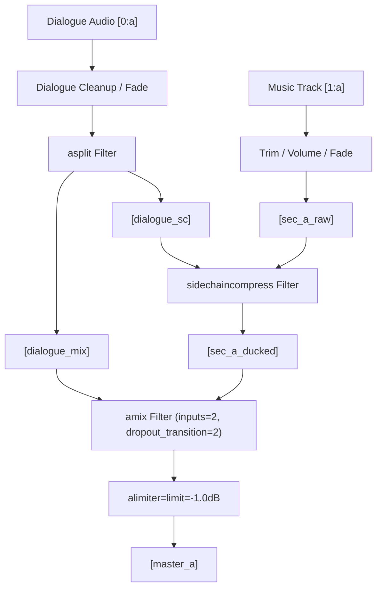

# Vireo Audio + Voice Studio (Phase 20)

Professional Speech Cleanup, Audio Intelligence, Voiceover, Dynamic Sidechain Ducking & Multilingual Voice Pipeline for Vireo Video AI.

---

## 1. Architectural Overview

The **Vireo Audio + Voice Studio** transforms raw audio into studio-grade master sound for vertical and short-form video content. It delivers:
- **Non-Destructive Acoustic Analysis**: Real-time evaluation of EBU R128 integrated loudness (LUFS), true peak (dBTP), loudness range (LU), RMS/mean volume, digital clipping detection, and silence-to-speech activity ratios.
- **Studio-Grade Speech Enhancement**: Multi-stage audio DSP filter graph including highpass rumble elimination, 50Hz/60Hz AC electrical hum notch filtering, FFT background noise reduction (`afftdn`), sibilance de-essing, 3-band parametric EQ, vocal dynamics leveling (`acompressor`), EBU R128 loudness normalization (`loudnorm`), and lookahead brickwall peak limiting (`alimiter`).
- **Speech Intelligence**: Whisper word-level filler word detection (`um`, `uh`, `you know`), repeated take / false start detection, and multi-mode silence tightening planner (`natural`, `tight`, `fast`) with boundary safety buffers.
- **Hardware-Accurate Dynamic Sidechain Ducking**: Native FFmpeg `sidechaincompress` architecture where dialogue triggers dynamic attenuation of background music, sound effects, and B-roll audio, combined via `asplit` branching and master peak limiting.
- **Voiceover & Consent-Protected Voice Pipeline**: Modular `VoiceProvider` architecture supporting ElevenLabs and OpenAI TTS with explicit `NOT_CONFIGURED` handling when credentials are missing, zero fake voices, zero mock synthesis, and mandatory affirmative consent statements for voice cloning.
- **Render Graph V2 Multi-Track Mixer**: Seamless integration into the Vireo Pro Editor rendering pipeline.

---

## 2. Non-Destructive Media Architecture & Safety

1. **Source Immutability**: All original dialogue and video assets remain 100% untouched on disk. Enhancements, ducking, and trims are compiled strictly as non-destructive filter complexes or isolated rendered cache snippets.
2. **In-Memory Caching**: Audio analysis metrics are indexed by absolute file path and checked against file `mtimeMs` and size. Re-analysis of unchanged files occurs with zero disk overhead.
3. **No Digital Overs**: All output audio tracks are protected by a lookahead brickwall limiter (`alimiter=limit=-1.0dB:attack=5:release=50`) on the master bus, ensuring true peaks never clip at 0 dBFS.

---

## 3. Audio Analysis & Acoustic Metrics

The `AudioAnalysisService` combines `ffprobe` stream metadata probing, FFmpeg `ebur128`, `volumedetect`, and `silencedetect` into unified acoustic metrics:

| Metric | Measurement Tool | Target / Safe Range | Description |
| :--- | :--- | :--- | :--- |
| **Integrated Loudness** | EBU R128 (`ebur128`) | -14 to -16 LUFS (Web/Social) | Perceived audio loudness across the entire track |
| **True Peak** | EBU R128 (`ebur128`) | $\le$ -1.0 dBTP | Maximum instantaneous peak preventing inter-sample clipping |
| **Loudness Range (LRA)** | EBU R128 (`ebur128`) | 4.0 to 12.0 LU | Dynamic variation between quiet and loud passages |
| **Mean Volume (RMS)** | FFmpeg `volumedetect` | -22 to -18 dBFS | Overall root-mean-square energy |
| **Digital Clipping** | `volumedetect` + peak | 0 detected | Identifies samples reaching 0 dBFS ceiling |
| **Silence / Speech Ratio** | FFmpeg `silencedetect` | $\le$ 15% silence | Fraction of timeline occupied by pauses vs active vocal energy |

---

## 4. Speech Enhancement Pipeline & Filter Presets

Audio enhancement compiles an ordered chain of native FFmpeg audio filters:

```mermaid
graph LR
    Input["Input Audio Stream"] --> Highpass["Highpass Filter (80Hz)"]
    Highpass --> Hum["50/60Hz Hum Notches"]
    Hum --> Denoise["FFT Denoise (afftdn)"]
    Denoise --> Deess["6kHz De-esser"]
    Deess --> EQ["3-Band Parametric EQ"]
    EQ --> Comp["Voice Compressor (acompressor)"]
    Comp --> Norm["EBU R128 Normalizer (loudnorm)"]
    Norm --> Limiter["Lookahead Limiter (alimiter -1dB)"]
    Limiter --> Output["Enhanced Audio Stream"]
```



### Presets

1. **`off`**: Bypasses all processing. Source audio passes through raw.
2. **`natural`**: Gentle rumble filter (60Hz), subtle noise suppression (15%), gentle transparent compression (2:1 ratio).
3. **`clean`**: Highpass at 80Hz, 50/60Hz hum notch, 35% FFT denoise, de-esser at 6kHz, vocal compression (3:1 ratio), +1.5dB presence boost at 2.2kHz, normalized to -16 LUFS.
4. **`podcast`**: Highpass at 85Hz, 50% FFT denoise, aggressive de-esser, warm vocal compression (3.5:1 ratio), +2.0dB low-end body at 180Hz, +2.5dB vocal presence at 2.2kHz, normalized to -16 LUFS.
5. **`studio`**: Highpass at 100Hz, 65% FFT denoise, tight sibilance suppression, broadcast vocal compression (4:1 ratio), 3-band contour EQ, normalized to -14 LUFS with strict -1.0 dBTP limiter.

*Note: Unsupported engines such as AI echo removal or multi-stem vocal isolation explicitly report `NOT_CONFIGURED` without injecting fake audio.*

---

## 5. Dynamic Sidechain Ducking Architecture

Background music, sound effects, and secondary B-roll video tracks automatically lower in volume whenever dialogue is detected:



### Ducking Parameters & Presets

- **Linear Threshold Conversion**: `threshold_linear = 10^(threshold_db / 20)`.
- **`subtle`**: Threshold -24dB, Ratio 4:1, Attack 40ms, Release 400ms.
- **`balanced`**: Threshold -30dB, Ratio 8:1, Attack 30ms, Release 350ms.
- **`strong`**: Threshold -36dB, Ratio 14:1, Attack 15ms, Release 250ms.

### B-Roll Audio Modes
- **`muted`**: Secondary B-roll video audio is stripped entirely.
- **`original`**: Plays B-roll audio at normal volume.
- **`auto_duck`**: B-roll audio dynamically compresses under dialogue with balanced sidechain ducking.

---

## 6. Speech Intelligence & Timeline Tightening

### 1. Filler Word Removal
- **Vocabulary**: Detects single words (`um`, `uh`, `er`, `ah`, `like`, `so`) and multi-word phrases (`you know`, `i mean`).
- **Safety Buffers**: 50ms padding before start and after end prevents cutting word onsets or natural consonant decays.

### 2. Repeated Take / False Start Detection
- Identifies consecutive word windows ($N \ge 2$) repeated verbatim after a short pause ($\le$ 2.0s), flagging the earlier incomplete take for removal.

### 3. Silence Tightening
- **`natural`**: Retains up to 400ms pauses for thoughtful, conversational pacing.
- **`tight`**: Tightens pauses down to 150ms for modern YouTube/Reels pacing.
- **`fast`**: Aggressively trims pauses down to 50ms for rapid-fire viral shorts.

---

## 7. Voiceover & Voice Cloning Protections

### Voice Provider Interface
```typescript
export interface VoiceProvider {
  name: string;
  isConfigured(): boolean;
  getCapabilities(): VoiceProviderCapabilities;
  listVoices(): Promise<VoiceOption[]>;
  generateSpeech(request: TTSRequest, userId: string): Promise<TTSResult>;
  cloneVoice(request: VoiceCloneRequest, userId: string): Promise<VoiceProfile>;
}
```

### Unconfigured Behavior & Zero-Fake Guarantee
- If `ELEVENLABS_API_KEY` is not present, `ElevenLabsVoiceProvider.isConfigured()` returns `false`, `listVoices()` returns `[]`, and calls throw `[PROVIDER_NOT_CONFIGURED]`.
- No mock audio files or fake synthetic voices are generated in production code.

### Voice Cloning Consent Protection
- Voice cloning strictly enforces affirmative consent:
  - `consent_confirmed: true`
  - Non-empty `consent_statement: string` (e.g., *"I verify that I own this voice and authorize Vireo to clone it."*)
  - Rejection with `[CONSENT_REQUIRED]` if consent is absent or empty.

---

## 8. Database Schema & Multi-Tenant Isolation

### Collections
1. **`audio_assets`**: Stores source dialogue, music, sound effects, voiceovers, and rendered previews.
2. **`voiceovers`**: Records voice synthesis generation jobs, text scripts, and associated project clips.
3. **`voice_profiles`**: Stores cloned voice metadata and affirmative consent audit logs.

### Indexes
- `audio_assets`: `id` (unique), `user_id + created_at`, `project_id`, `clip_id`, `source_type`.
- `voiceovers`: `id` (unique), `user_id + created_at`, `project_id`.
- `voice_profiles`: `id` (unique), `user_id + created_at`, `provider_voice_id`.

### Multi-Tenant Isolation
All data operations are wrapped in `ownerContext.run(userId, ...)` guaranteeing zero cross-tenant data leakage (IDOR prevention).
