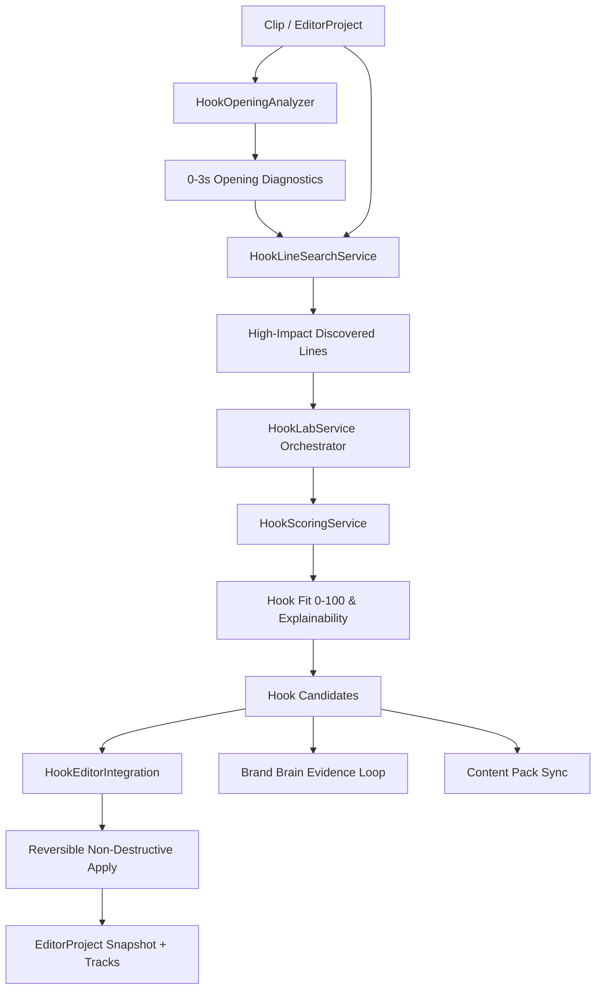

# Phase 24 — Vireo Hook Lab

## Overview

**Vireo Hook Lab** is a dedicated opening-intelligence system designed for short-form creators. It analyzes the opening 1–5 seconds of a clip, detects critical retention barriers (dead air, filler words, slow speech latency), discovers punchy source lines later in the video, generates grounded hook variants across multiple delivery modes, computes explainable Hook Fit scores (0–100), and applies reversible, non-destructive enhancements directly to `EditorProject`.

---

## 1. Architecture & Design Principles



### Core Tenets
1. **Source Grounding & Anti-Hallucination**: Every hook candidate is anchored to real dialogue, verbatim timestamps, or transcript evidence. Unsupported quantitative claims, fake discounts, and fabricated percentages are penalized.
2. **Source Media Immutability**: Underlying MP4/WAV video and audio files remain strictly immutable. Trims, cuts, and reorders are expressed purely as non-destructive timeline offsets on `EditorTrackItem`.
3. **Full Reversibility**: Any applied hook operation (trim, reorder, text overlay, caption emphasis) takes a snapshot of the prior `EditorProject` state, permitting 1-click restore without data loss.
4. **Claim Guard & Quote Safety**: Strict validation guarantees that direct quotes match verbatim source audio and prevents prohibited absolute guarantees.
5. **No Fabricated Analytics**: When a creator lacks published clip history (<3 published clips), Hook Lab honestly displays an `INSUFFICIENT_DATA` advisory signal rather than generating synthetic metrics.

---

## 2. Opening Analysis & Signal Diagnostics

`HookOpeningAnalyzer` inspects the initial 1–5 seconds (default 3.0s) of a clip:

- **Speech Latency Measurement**:
  - `FAST`: First meaningful speech starts at `< 1.0s`.
  - `MODERATE`: Speech starts between `1.0s – 2.5s`.
  - `SLOW`: Speech starts after `> 2.5s` (dead air penalty).
- **Silence & Filler Detection**:
  - Utilizes `SpeechIntelligenceService` to detect leading filler words (`um`, `uh`, `so`, `like`, `you know`) and dead air intervals.
- **Current Hook Classification**:
  - Scans tracks and segments to classify the current opening as `TRANSCRIPT`, `TEXT_OVERLAY`, `CAPTION`, or `NO_CLEAR_HOOK`.
- **Multimodal Signal Reuse**:
  - Reuses existing scene cut intervals, visual motion scores, and face presence intervals without re-running expensive computer vision pipelines.
- **Diagnostic Output**:
  - Compiles structured `issues` (e.g. `FILLER_WORD_IN_OPENING`, `SLOW_START`, `NO_CLEAR_HOOK`) and `strengths` (e.g. `FAST_SPEECH_LATENCY`, `CLEAR_TRANSCRIPT_OPENING`).

---

## 3. High-Impact Source Line Discovery

`HookLineSearchService` scans the remainder of the clip (excluding the initial 2.0s) to discover punchy lines suitable for a reorder hook:

- **Contrast & Tension Keywords**: Evaluates terms such as `mistake`, `secret`, `truth`, `warning`, `worst`, `failed`, `never`, `stop`.
- **Quantitative Concrete Anchors**: Awards points for numbers, measurements, and timelines (e.g., `30 seconds`, `10x`, `hours`).
- **Length & Brevity Optimization**: Prioritizes concise sentences between 5 and 15 words.
- **Reorder Plan Generation**:
  - Produces a valid `HookReorderPlan` specifying `{ source_start, source_end, source_text, target_timeline_position: 0, resume_original_at }`.

---

## 4. Deterministic Hook Fit Formula (0–100)

The overall Hook Fit score is deterministically calculated across 7 weighted dimensions:

$$\text{Hook Fit} = 0.25 \cdot \text{Grounding} + 0.15 \cdot \text{Clarity} + 0.15 \cdot \text{Specificity} + 0.10 \cdot \text{Curiosity} + 0.10 \cdot \text{Brevity} + 0.10 \cdot \text{Brand Fit} + 0.15 \cdot \text{Opening Fit}$$

| Dimension | Weight | Description & Scoring Logic |
|---|---|---|
| **Grounding** | 25% | Lexical token overlap with source transcript. Penalized heavily if ungrounded claims or hallucinated facts are detected. |
| **Clarity** | 15% | Immediate understandability, active phrasing, concise word structure. |
| **Specificity** | 15% | Concrete subject anchors (numbers, tools, exact methods) vs. vague pronouns (`this`, `stuff`). |
| **Curiosity** | 10% | Curiosity gap or provocative framing (`QUESTION`, `CURIOSITY_GAP`, `CONTRARIAN`). |
| **Brevity** | 10% | Optimal length (< 12 words scores highest; > 18 words receives caution). |
| **Brand Fit** | 10% | Alignment with Brand Brain voice tones. Severe penalty if `avoid_phrasing` terms appear. |
| **Opening Fit** | 15% | Feasibility of delivery in 1–5s without eating into clip payload. |

### Hard Penalty Caps
- If `Grounding < 50`: `Overall Hook Fit` cannot exceed **38**.
- If `Brand Fit < 40`: `Overall Hook Fit` cannot exceed **48**.

---

## 5. Candidate Generation & Delivery Modes

Hook Lab generates candidates spanning 6 distinct delivery modes:

1. **`SPOKEN_REWRITE`**: Natural voice spoken alternatives grounded in the transcript payload.
2. **`EDITORIAL_TRIM`**: Automatically cuts leading dead air/filler so speech starts within the first 0.5s.
3. **`REORDER_EXISTING`**: Relocates a high-tension quote from later in the clip to the 0s mark, then transitions back to clip start.
4. **`TEXT_OVERLAY`**: Places a bold, styled headline on the `TEXT` track during seconds 0–3 to grab visual attention.
5. **`CAPTION_OPEN`**: Emphasizes or replaces the first caption cue for high visual retention.
6. **`COMBINED`**: Merges editorial silence trim with an animated text overlay.

### Candidate Set Diversity
Hook Lab guarantees candidate set diversity:
- Spans at least 3 distinct hook types (`QUESTION`, `CONTRARIAN`, `DIRECT`, `WARNING`, etc.).
- Spans multiple delivery modes.
- Supports user directives (e.g. `"Make it punchier"`, `"Target TikTok audience"`).
- Candidate locking preserves selected hooks across regenerations.

---

## 6. Non-Destructive Reversible Editor Integration

Hook operations integrate seamlessly with `ProEditorService`:

```typescript
// Applying a candidate to EditorProject
const { updatedProject, previousProjectSnapshot, appliedOperations } = 
  await HookLabService.applyCandidateToEditor(sessionId, candidateId, userId, editorProjectId);

// Reverting an applied candidate back to previous state
const restoredProject = 
  await HookLabService.revertCandidateInEditor(sessionId, candidateId, userId, editorProjectId, snapshot);
```

- **Snapshots**: Captured in-memory or persisted on client/session before mutation.
- **Track Modification**: Adjusts `timeline_start`, `source_start`, or adds overlay items on the `TEXT` track.
- **Source Media**: Never altered.

---

## 7. Brand Brain Integration

1. **Context Awareness**: Retrieves active Brand Brain profile (voice tones, avoided phrases) during candidate generation and scoring.
2. **Evidence Recording**: When a creator approves a candidate (`status: 'APPROVED'`), `BrandEvidenceService` records a new evidence entry:
   - `sourceType: 'HOOK_LAB'`
   - `dimension: 'hooks'`
   - `value: { hook_type, text, delivery_mode }`
3. **Self-Improving Memory**: Preferred hook structures influence future candidate generation across Vireo.

---

## 8. Content Pack Synchronization

- **Import from Content Pack**: Users can import `HOOK` variants generated in Phase 23 Content Packs into Hook Lab for deep analysis, fit scoring, and editor apply.
- **Direct Workspace Transition**: Hook cards inside `ContentPackWorkspace` include an "Open in Hook Lab" action, preloading the hook directly into the opening intelligence suite.

---

## 9. API Reference

| Endpoint | Method | Description |
|---|---|---|
| `/api/hook-lab/capabilities` | `GET` | Returns supported types, modes, and limits. |
| `/api/hook-lab/sessions` | `POST` | Creates or retrieves session for a clip. |
| `/api/hook-lab/sessions/:id` | `GET` | Fetches session, analysis, and candidate set. |
| `/api/hook-lab/sessions/:id/candidates` | `POST` | Generates or regenerates candidate set. |
| `/api/hook-lab/sessions/:id/candidates/:candidateId` | `PATCH` | Updates text or toggle lock. |
| `/api/hook-lab/sessions/:id/candidates/:candidateId/regenerate` | `POST` | Regenerates a single unlocked candidate. |
| `/api/hook-lab/sessions/:id/candidates/:candidateId/apply` | `POST` | Applies hook to `EditorProject` non-destructively. |
| `/api/hook-lab/sessions/:id/candidates/:candidateId/revert` | `POST` | Reverts applied hook using snapshot. |
| `/api/hook-lab/sessions/:id/candidates/:candidateId/approve` | `POST` | Approves hook and writes Brand Brain evidence. |
| `/api/hook-lab/sessions/:id/candidates/:candidateId/preview` | `POST` | Renders lightweight local preview video. |
| `/api/hook-lab/sessions/:id/import-content-pack` | `POST` | Imports hook items from Content Pack. |
| `/api/hook-lab/sessions/:id/sync-content-pack` | `POST` | Synchronizes hook candidates back to Content Pack. |
| `/api/hook-lab/analytics-advisory` | `GET` | Returns honest advisory signal. |
